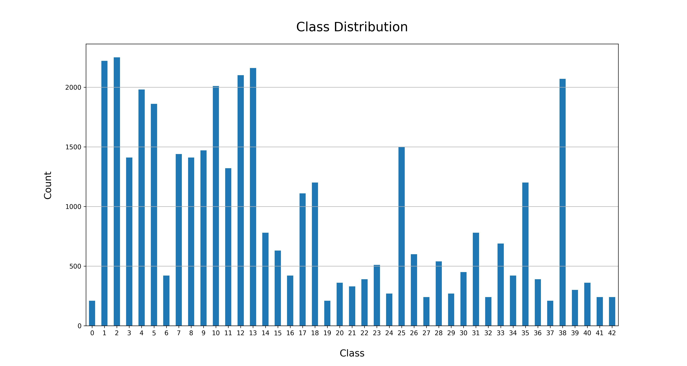
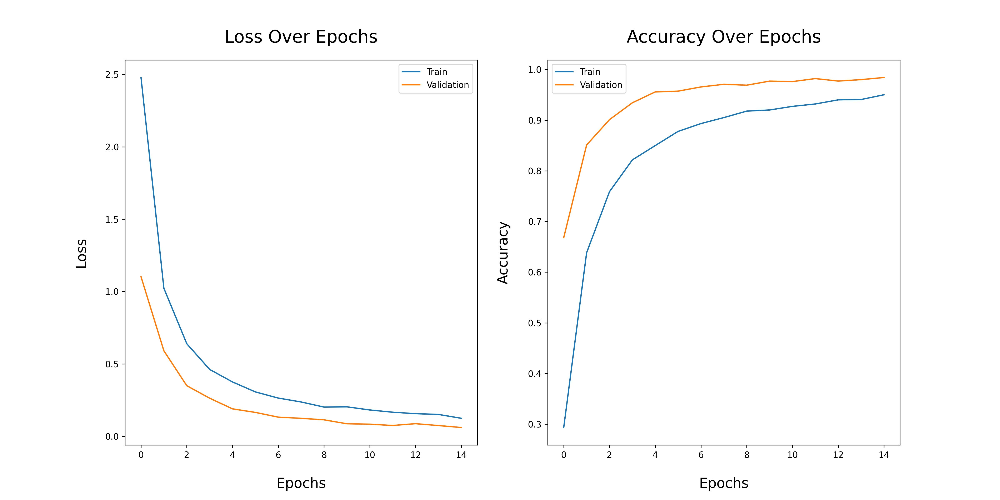

# Traffic Sign Classification

## Data source
This data is derived from the German Traffic Sign on [Kaggle](https://www.kaggle.com/datasets/meowmeowmeowmeowmeow/gtsrb-german-traffic-sign).

## Class Imbalance Handling

Due to the imbalance in the dataset, class weights were used.

## Model performance

The model achieved a test accuracy of 94.33%.
